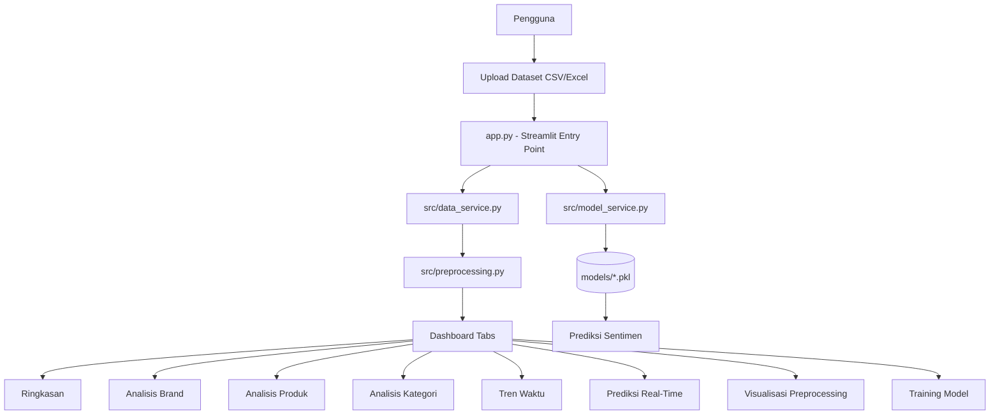
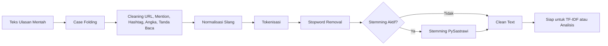
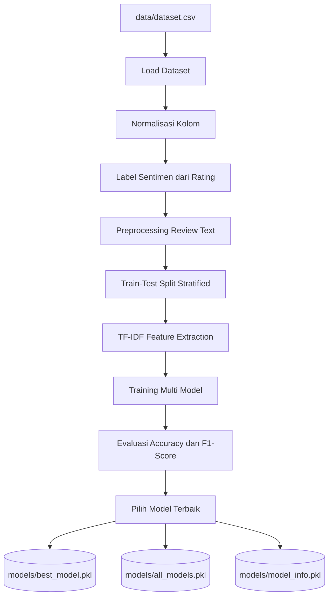
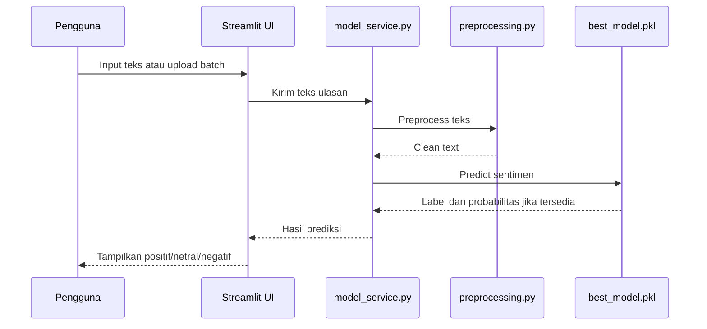
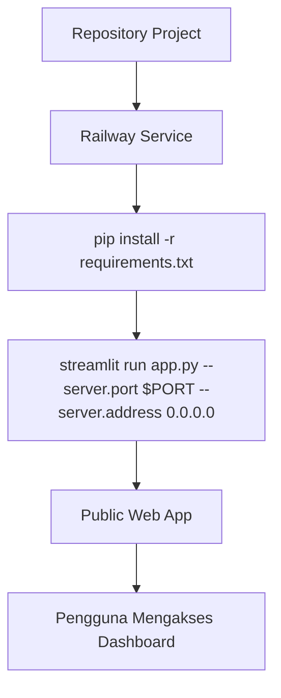

# Diagram Project SentiPro

Dokumen ini memakai Mermaid agar diagram bisa dibaca langsung di VS Code,
GitHub, atau Markdown viewer yang mendukung Mermaid.

## 1. Arsitektur Aplikasi

## 2. Pipeline Preprocessing Teks

## 3. Alur Training Model

## 4. Alur Prediksi Sentimen

## 5. Deployment Railway

