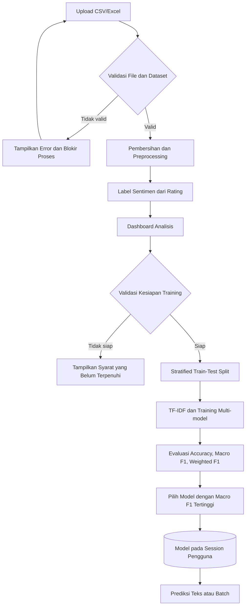
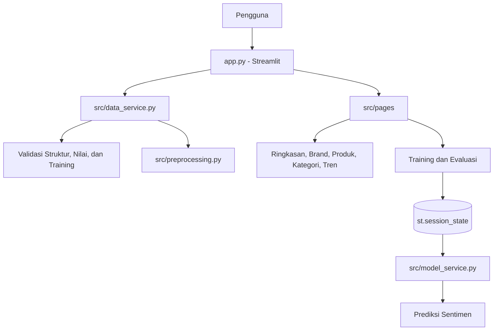
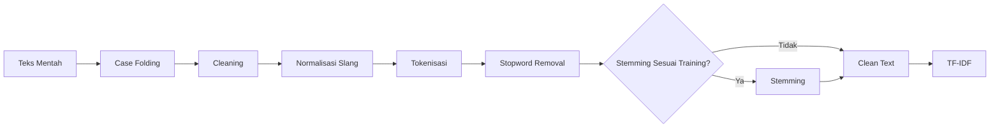
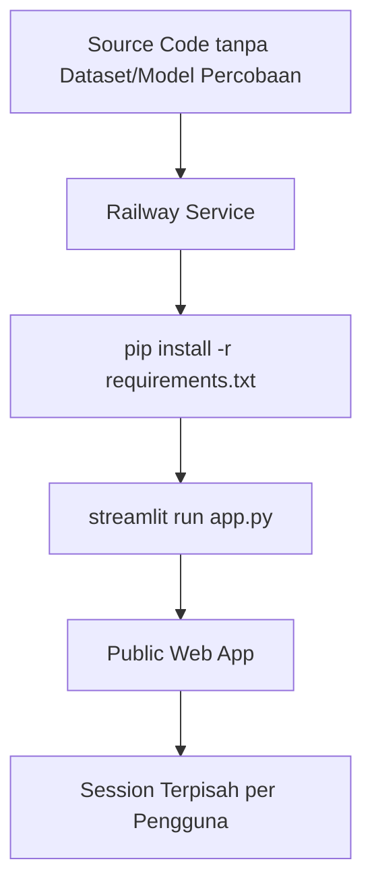

# Diagram Project SentiPro

## 1. Workflow Wajib Pengguna

## 2. Arsitektur Aplikasi

Dataset dan model percobaan tidak menjadi input bawaan aplikasi. Model sesi
otomatis dihapus ketika dataset upload diganti atau dihapus.

## 3. Pipeline Preprocessing

Konfigurasi stemming yang dipilih saat training selalu digunakan kembali saat
prediksi.

## 4. Deployment Railway

